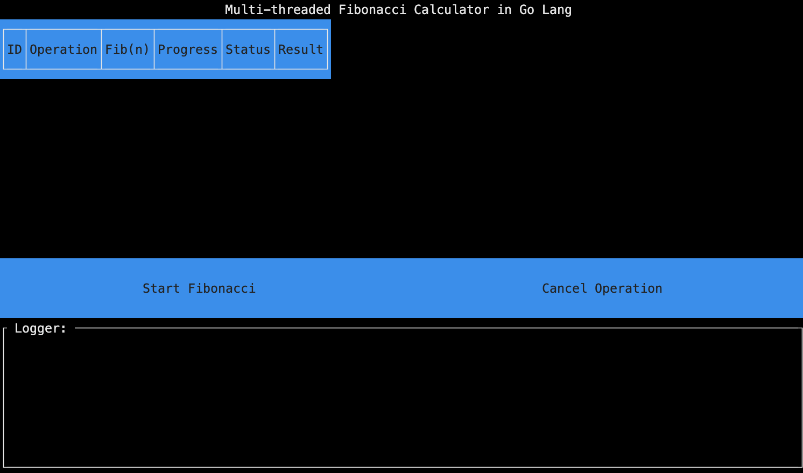
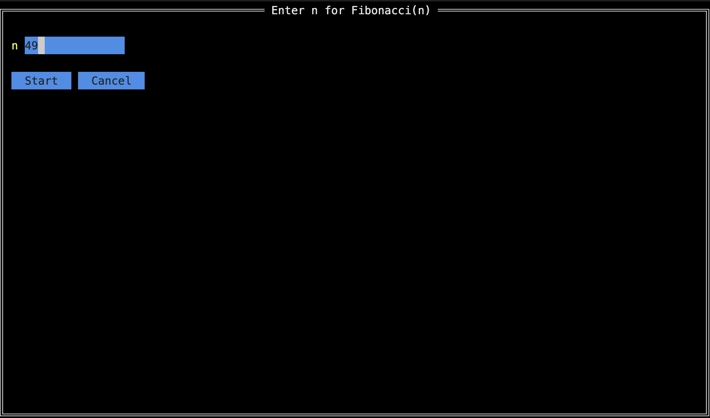
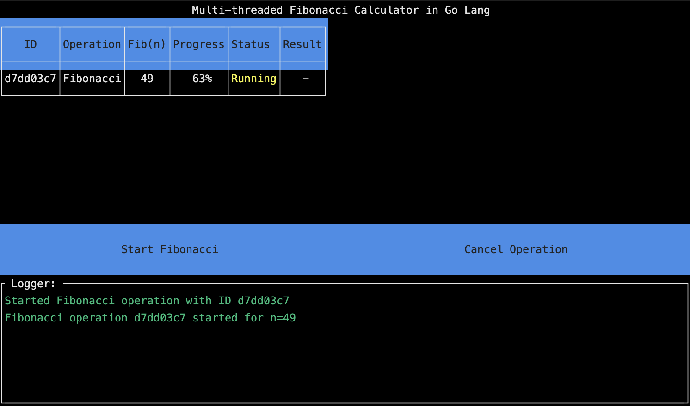
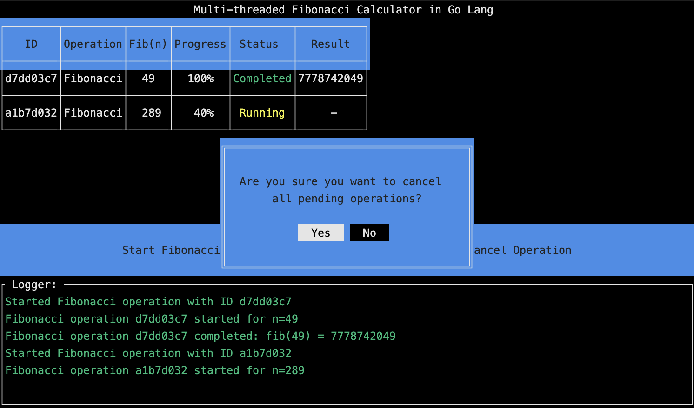
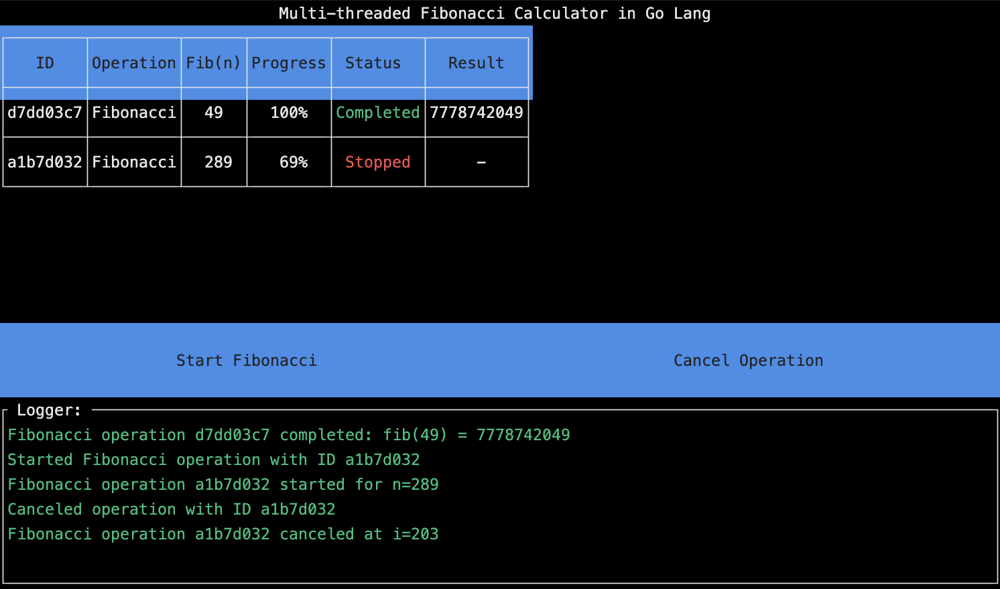
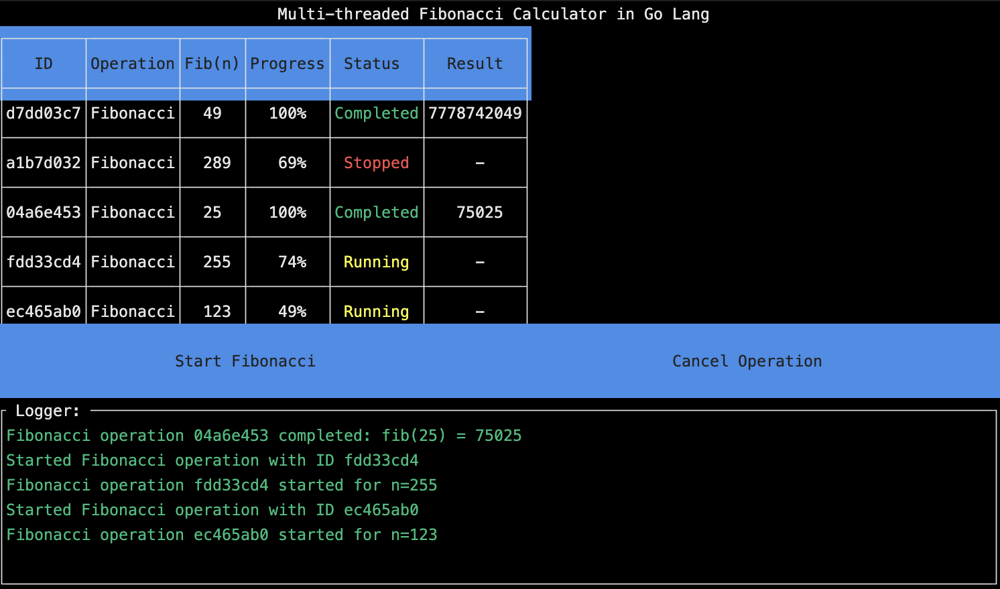

# Multi-threaded Fibonacci Calculator in Go Lang

### Table of Contents

  - [Overview](#overview)
  - [Features](#features)
  - [Motivation](#motivation)
  - [File Structure and Calculation Flow](#file-structure-and-calculation-flow)
  - [Third-party Libraries](#third-party-libraries)
  - [Running Locally](#running-locally)
    - [Prerequisites](#prerequisites)
    - [Installation](#installation)
  - [Compilation](#compilation)
    - [Windows](#windows)
    - [macOS (Intel chip)](#macos-intel-chip)
    - [macOS (Apple Silicon chip)](#macos-apple-silicon-chip)
    - [Linux](#linux)
  - [Screenshots](#screenshots)

## Overview

The **Multi-threaded Fibonacci Calculator** is a Go application that calculates Fibonacci numbers using concurrent goroutines. It provides a text-based user interface (TUI) built with the `tview` library, allowing users to start multiple Fibonacci calculations simultaneously and monitor their progress in real-time.

## Features

- **Concurrent Calculations**: Start multiple Fibonacci calculations concurrently using Go's goroutines.
- **Cancellation Support**: Cancel all ongoing operations at once.
- **Timeout Handling**: Automatically cancels operations that exceed a predefined timeout (10 seconds) to prevent long-running calculations from blocking resources.
- **Real-time Updates**: View the progress, status, and results of each operation in real-time.
- **Text-based User Interface**: Interactive TUI built with `tview`, compatible across Windows, macOS, and Linux terminals.

## Motivation

This project was created to learn about the concurrency mechanisms in Go and is part of a project conducted in the **Advanced Programming Technologies** course at the **Academy of Humanities and Economics in Łódź**.

I used and recommend the following materials to deepen knowledge of Go concurrency:

- **A Tour of Go**: An interactive tutorial that covers the basics of Go, including concurrency patterns. [Visit the Tour of Go](https://go.dev/tour/concurrency).
- **"Working with Concurrency in Go (Golang)" Course**: An Udemy course by Professor Trevor Sawler that provides in-depth coverage of Go's concurrency features. [View the course on Udemy](https://www.udemy.com/course/working-with-concurrency-in-go-golang/).

## File Structure and Calculation Flow

```
├── go.mod
├── main.go
├── thread_manager.go
├── fib.go
├── ui.go
```

- **go.mod**: Go module file specifying dependencies.
- **main.go**: Entry point of the application. Initializes the application, UI, and starts the event loop.
- **thread_manager.go**: Contains the `ThreadManager` struct, which manages the lifecycle and state of concurrent operations.
- **fib.go**: Implements the Fibonacci calculation logic, including concurrency control and cancellation.
- **ui.go**: Sets up the user interface components using `tview`, handles user interactions, and updates the UI based on operation states.

**Calculation Flow**:

1. **User Interaction**: The user starts a new Fibonacci calculation via the UI.
2. **Operation Initialization**: `ThreadManager` creates a new operation, initializes context with timeout, and starts the calculation in a goroutine.
3. **Calculation**: The Fibonacci calculation runs concurrently, updating progress and checking for cancellation.
4. **Progress Updates**: Updates are sent to the UI to refresh the operation table and logger.
5. **Completion or Cancellation**: The operation completes successfully or is canceled due to user action or timeout, updating the status and results accordingly.

## Third-party Libraries

- **[tview](https://github.com/rivo/tview)**: Used to build the text-based user interface.
- **[tcell](https://github.com/gdamore/tcell)**: Provides cell-based text handling for terminals, used by `tview`.

## Running Locally

### Prerequisites

- **Install Go lang (latest stable version)**: [Download Go](https://go.dev/dl/)

### Installation

1. **Clone the Repository**:

   ```bash
   git clone https://github.com/JakubMaslanka/multithread-fib-calculator.git
   cd multithread-fib-calculator
   ```

2. **Download Dependencies**:

   ```bash
   go mod download
   ```

2. **Running the Application**:

    To run the application without compiling:
   ```bash
   go run .
   ```

## Compilation

### Windows

```cmd
set GOOS=windows
set GOARCH=amd64
go build -o fib_calculator.exe
fib_calculator.exe
```

### macOS (Intel chip)

```bash
GOOS=darwin GOARCH=amd64 go build -o fib_calculator
./fib_calculator
```

### macOS (Apple Silicon chip)

```bash
GOOS=darwin GOARCH=arm64 go build -o fib_calculator
./fib_calculator
```

### Linux

```bash
GOOS=linux GOARCH=amd64 go build -o fib_calculator
./fib_calculator
```

## Screenshots






